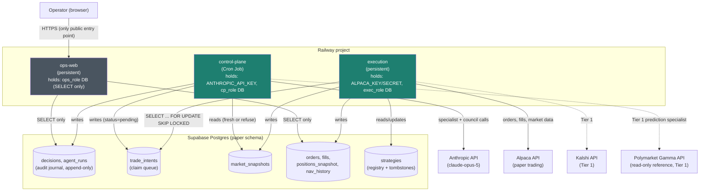
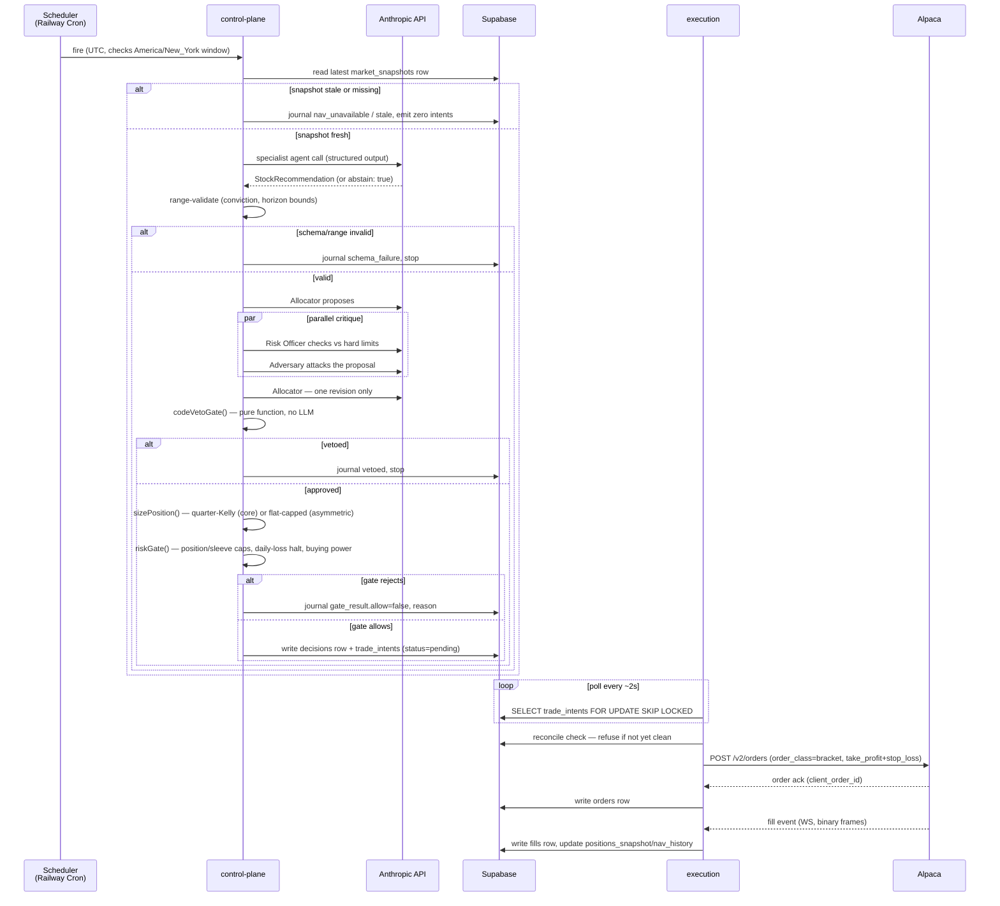

# Architecture

Companion to [Council Protocol](DECISION_LOG.md#3-architecture-decisions-council-protocol)
and [Ship Order](DECISION_LOG.md#4-mvp-specification-ship-order) — this doc is
the diagram-level view of the same decisions, kept in-repo so it renders
directly on GitHub and doesn't depend on the web artifacts staying reachable.

## System components (Tier 0)

**The invariant this diagram exists to enforce:** no arrow points from the
public internet into `control-plane` or `execution`. The only public entry
point is `ops-web`, and it holds no broker or LLM credential — a full
compromise of `ops-web` yields read access to already-public-adjacent
account state, never a credential that can move money or spend API budget.

`control-plane` and `execution` never call each other over HTTP. They
communicate exclusively through the database: `execution` writes
`market_snapshots` slightly ahead of the decision cycle; `control-plane`
reads the latest row and refuses to proceed if it's stale, rather than
fetching market data directly (which would require `control-plane` to hold
Alpaca credentials, since the data key and trading key are the same key).

## Credential / DB-role matrix

| Service | External credential | DB role | Grants |
|---|---|---|---|
| `control-plane` | `ANTHROPIC_API_KEY` | `cp_role` | INSERT/SELECT `agent_runs`, `decisions`, `trade_intents`; SELECT `nav_history`, `positions_snapshot`, `market_snapshots` |
| `execution` | `ALPACA_KEY`, `ALPACA_SECRET` | `exec_role` | SELECT/UPDATE `trade_intents`; INSERT `orders`, `fills`, `nav_history`, `positions_snapshot`, `market_snapshots` |
| `ops-web` | none | `ops_role` | SELECT only, all tables |

`decisions` and `fills` have `UPDATE, DELETE` revoked from all three roles at
the database level — the append-only audit design is a database-enforced
guarantee, not just a code convention.

## Decision loop (one trading cycle)

Every branch that stops short of a filled order still writes to the journal —
"no trade this cycle" is a logged, expected outcome, not a silent no-op.

## What's live vs. planned

| Layer | Status |
|---|---|
| Contracts (`packages/contracts`) | Built — all 5 schemas, range validation verified |
| DB schema, roles, RLS-equivalent grants | Designed (Ship Order §1), not yet migrated — needs a Supabase project |
| Service scaffolds + credential guards | Built and verified (`services/*`) |
| Specialist agent, council, sizer, risk gate | Not yet implemented (M3/M5) |
| Stock sleeve (Alpaca) | Tier 0 — in progress |
| Crypto sleeve, Kalshi prediction sleeve, Polymarket reference feed | Tier 1 — not started |
| Macro data pipeline (GDELT, Federal Register, FRED, NWS/NHC) | Tier 2 — not started |
| Adaptive strategy loop, post-mortem classification, Strategy Observatory UI | Tier 2/3 — not started |
| Full circuit-breaker suite (L1–L6), flatten-all kill switch | Tier 3 — not started; MVP carries a minimal deadman switch + spend cap only |
