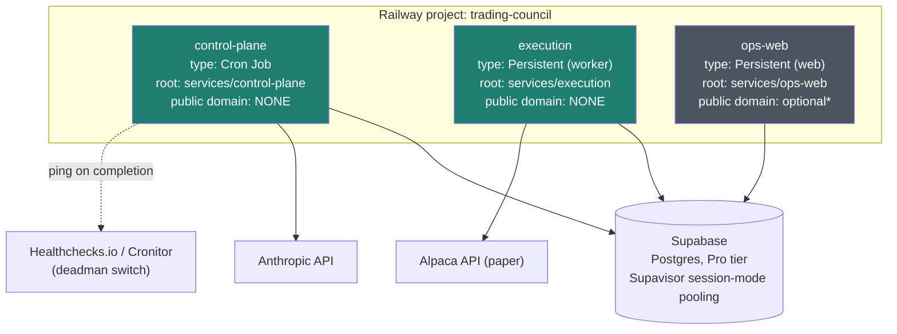

# Deployment

**Status: planned, not yet provisioned.** The Railway CLI is installed on the
dev machine but not authenticated (`railway login` requires an interactive
browser flow only the account owner can complete). Nothing described here
exists as real infrastructure yet — this is the plan to execute once
Supabase and Railway are set up.

## Why Railway

Same platform the legacy OptionPulse dashboard used, and it maps cleanly onto
the credential-isolation architecture: Railway's monorepo support lets each
service point at its own root directory with a disjoint set of environment
variables, which is exactly the `cp_role` / `exec_role` / `ops_role` /
Alpaca / Anthropic split this system requires — enforced at the platform
level, not by convention.

## Topology

\* `ops-web` can run as a hosted Railway service or on-demand from a local
machine for the 30-day MVP window — zero cost, zero public surface either
way, and `public/ops.html` is unchanged regardless. Urgent signals (deadman
switch, halt-state alerts) reach the operator by push regardless of where
`ops-web` runs; the page itself is for pull/detail, not paging. Deferrable
either direction — see [`docs/USER_INTERACTION.md`](USER_INTERACTION.md).

## Service configuration

| Service | Railway type | Root directory | Start command | Env vars |
|---|---|---|---|---|
| `control-plane` | Cron Job | `services/control-plane` | `npm start` | `ANTHROPIC_API_KEY`, `DATABASE_URL` (cp_role) |
| `execution` | Persistent | `services/execution` | `npm start` | `ALPACA_KEY`, `ALPACA_SECRET`, `ALPACA_PAPER=true`, `EXEC_DATABASE_URL` (exec_role) |
| `ops-web` | Persistent | `services/ops-web` | `npm start` | `OPS_DATABASE_URL` (ops_role) |

All three read `APP_MODE=paper` — reserved now so a later `live` cutover is a
config change, not a redeploy of different code (see `.env.example`).

## The one real caveat: UTC-only cron

Railway evaluates cron schedules in **UTC only**, with no timezone support.
Ship Order's M1 calls for pinning the scheduler to `America/New_York`
specifically because the 30-day MVP window crosses a DST boundary. Rather
than hardcode a UTC offset that silently drifts by an hour twice a year, the
plan is: the Cron Job fires on a UTC schedule wide enough to cover both
DST states, and `control-plane`'s entrypoint checks the actual
`America/New_York` wall-clock time on wake and no-ops (logging why) if it's
outside the intended trading window. A few lines of code, and it removes the
drift entirely instead of managing it manually twice a year.

A Railway Cron Job must **exit on completion** — if the process doesn't
terminate, subsequent scheduled runs are skipped. This is actually a better
fit for `control-plane` than the in-process `node-cron` approach originally
sketched in Ship Order M5: it sidesteps the exact failure mode devops
flagged there (a Railway redeploy restarting a long-lived process and
silently skipping a scheduled fire), since Railway's cron scheduler runs
independently of whether the app process is "up," and gives a real run
history for free.

## Not yet decided / needs the account owner

- Supabase project creation (Pro tier) and the `DATABASE_URL` /
  `EXEC_DATABASE_URL` / `OPS_DATABASE_URL` connection strings per role.
- `railway login` (interactive) — blocks `railway init` / `railway up` /
  env var configuration via CLI.
- Whether `ops-web` gets a public Railway domain or runs locally for the
  30-day window.
