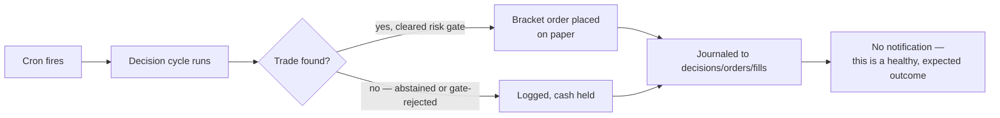
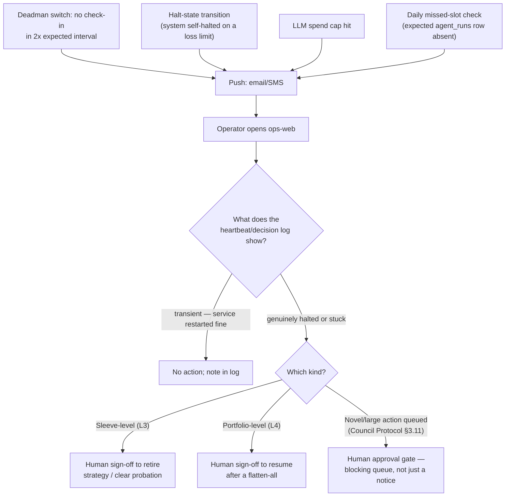

# User (Operator) Interaction

The system is designed to run **unattended** — the 30-day MVP success
criterion is a solo operator who doesn't have to watch it. This doc covers
the two shapes interaction actually takes: routine (none) and exception
(push notification → operator decides).

Design principle carried over from Council Protocol/Ship Order: **push for
urgent, pull for detail.** Anything that requires action reaches the
operator by an alert, not by them noticing something on a page. The
`ops-web` page exists for investigating *after* an alert, not for
ambient monitoring.

## Normal day — no operator action

An empty cycle (no recommendation, or a gate rejection) is **not** an
incident. Both paths log identically to the audit journal; the difference
only matters when reviewed on `ops-web` after the fact.

## Exception path — alert → investigate → (maybe) act

**No automated path resumes trading after L3 or L4 on its own** — those
specifically require a human decision, by design (Council Protocol §4.3).
This is the one place operator interaction is mandatory rather than optional.

## What "interaction" looks like at each layer

| Trigger | Channel | Operator action required? | Where it's handled |
|---|---|---|---|
| Routine decision cycle (trade or abstain) | None | No | Fully automated |
| Deadman switch miss | Push (email/SMS) | Investigate; act only if genuinely stuck | Ship Order M6 |
| Halt-state transition (self-halted) | Push | Investigate why; decide whether to clear | Council Protocol §4.3 |
| LLM spend cap hit | Push + halted run | Review the run; raise/adjust cap if legitimate | Ship Order M5 |
| Missed scheduled slot | Daily check, push if found | Confirm cause (deploy timing vs. real failure) | Ship Order devops lane |
| L3 — sleeve retirement | Requires sign-off | **Yes, mandatory** | Council Protocol §4.3/§4.4 |
| L4 — portfolio flatten | Requires sign-off | **Yes, mandatory** | Council Protocol §4.3 |
| Strategy promotion (shadow → live) | Requires sign-off | **Yes, mandatory** | Council Protocol §6.2 |
| Order > X% NAV, or novel action | Blocking approval queue | **Yes, mandatory** | Council Protocol §3.11 |
| Backup restore drill, key rotation | Manual, scheduled | Yes — operational task, not an alert | Ship Order M0/M6 |

## What the operator can see on `ops-web` (Tier 0)

Four panels, per Ship Order F1–F3 — deliberately minimal, not the full
Strategy Observatory (that's Tier 2/3, Council Protocol §6.6):

1. **Heartbeat** — last run timestamp/status, next scheduled run.
2. **Decision log** — last ~50 rows: ticker, recommendation, council verdict,
   order status, fill.
3. **Open positions** — symbol, side, qty, entry, stop, take-profit, unrealized P/L.
4. **NAV over time** — plain table/sparkline.

No controls. No buttons that place, cancel, or modify a trade. If a
human needs to *act* (clear a halt, approve a sign-off), that's a separate,
explicitly authenticated operation outside `ops-web`'s read-only scope — kept
that way deliberately, per Council Protocol §5.4.1's reasoning about why
`ops-web` never gets a write path.
